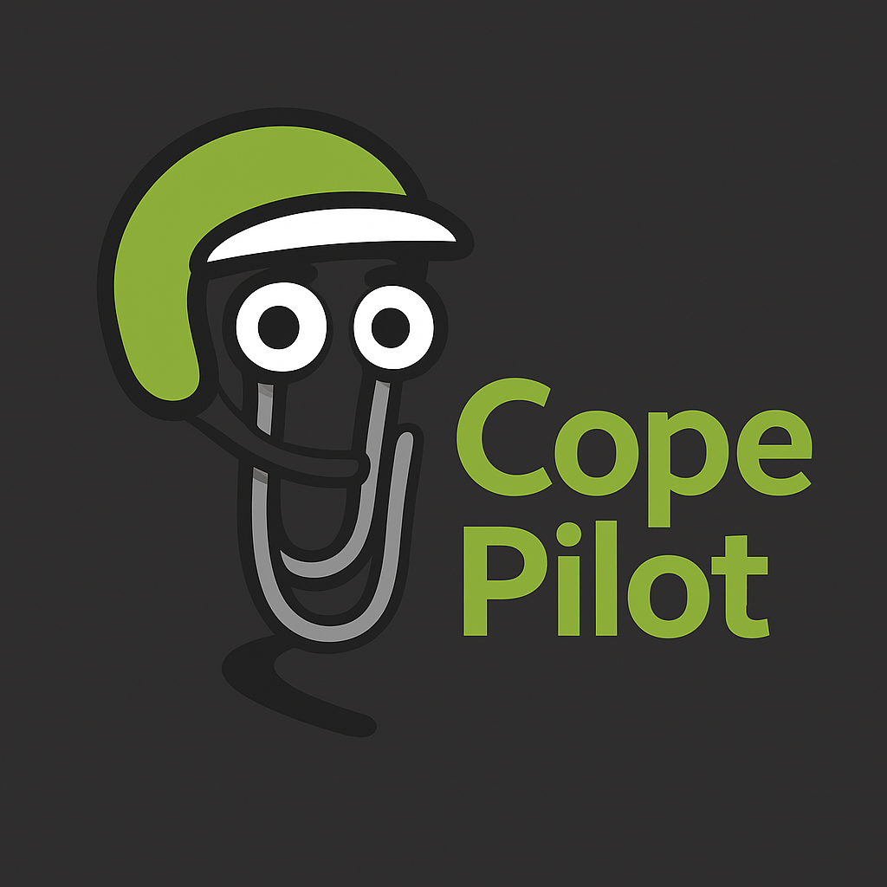

> **⚠️ WARNING: This project is for entertainment and educational purposes only. Do not use while driving on public roads. Always keep your eyes on the road and obey all traffic laws. The developers accept no responsibility for any accidents, injuries, or legal consequences resulting from the use of this software.**

<p align="center">
  
</p>

> **⚠️ WARNING: This project is for entertainment and educational purposes only. Do not use while driving on public roads. Always keep your eyes on the road and obey all traffic laws. The developers accept no responsibility for any accidents, injuries, or legal consequences resulting from the use of this software.**

Rally pacenote style driving assistance for your daily commute. Uses GPS and OpenStreetMap data to call out upcoming corners like a rally co-driver.

```
"three hundred... left four... one fifty... right three tightens..."
```

## Features

- Real co-driver voice using Nicky Grist audio samples
- Corner detection with severity ratings (1-6)
- Bridge callouts ("over bridge")
- T-junction warnings
- Chicane detection (left-right / right-left sequences)
- Visualization mode for testing
- VBO file replay from lap-timing-system
- Fast PBF loading with automatic caching

## How It Works

1. GPS provides current position and heading
2. Loads road network from local OSM PBF file (cached for fast subsequent loads)
3. Projects path ahead based on current heading (assumes straight-on at junctions)
4. Detects corners using ASC (Automated Segmentation based on Curvature) algorithm
5. Calls out corners with rally-style severity (1=hairpin to 6=flat)
6. Warns about T-junctions, bridges, and chicanes

## Hardware Requirements

- Raspberry Pi (3B+ or newer recommended)
- USB GPS module (any NMEA-compatible device)
- Speaker or audio output
- OSM PBF map file for your region

## Installation

### Raspberry Pi

```bash
# Install system dependencies
sudo apt install espeak-ng sox libsox-fmt-all python3-pip

# For osmium (PBF parsing)
sudo apt install python3-osmium

# Install CopePilot
pip install -e .
```

### macOS

```bash
# Install sox for audio effects
brew install sox

# Install osmium
pip install osmium

# Install CopePilot
pip install -e .
```

## Audio Samples

For authentic rally co-driver audio, place Nicky Grist sample files in `assets/NickyGrist/`:
- `NickyGrist.mp3` - Audio file containing all samples
- `NickyGrist.txt` - Timing markers for each sample

The system will fall back to TTS with radio effect if samples aren't available.

## Usage

```bash
# Run with real GPS
python3 -m src.copepilot.main --gps-port /dev/ttyACM0

# Simulate driving from a location (lat,lon,heading)
python3 -m src.copepilot.main --simulate 51.46,-2.46,0

# Simulate with visualization window
python3 -m src.copepilot.main --simulate 51.46,-2.46,0 --visualize

# Simulate at different speed (m/s)
python3 -m src.copepilot.main --simulate 52.0,-1.0,180 --speed 20

# Replay a VBO file from lap-timing-system
python3 -m src.copepilot.main --vbo /path/to/Driver1.vbo --speed-multiplier 3

# Adjust lookahead distance
python3 -m src.copepilot.main --simulate 51.5,-0.1,90 --lookahead 500

# Specify a different map file
python3 -m src.copepilot.main --simulate 51.46,-2.46,0 --map /path/to/region.osm.pbf

# Disable audio (print only)
python3 -m src.copepilot.main --simulate 51.46,-2.46,0 --no-audio
```

## Configuration

Edit `src/copepilot/config.py` to adjust:

| Setting | Default | Description |
|---------|---------|-------------|
| `LOOKAHEAD_DISTANCE_M` | 1000 | How far ahead to analyze |
| `CORNER_MIN_RADIUS_M` | 300 | Maximum radius to detect as corner |
| `CORNER_MIN_ANGLE_DEG` | 10 | Minimum angle to call out |
| `HEADING_TOLERANCE_DEG` | 30 | Angle tolerance for "straight on" |

## Pacenote Scale

Based on corner radius:

| Call | Severity | Radius |
|------|----------|--------|
| hairpin | 1 | < 15m |
| two | 2 | 15-30m |
| three | 3 | 30-50m |
| four | 4 | 50-80m |
| five | 5 | 80-120m |
| six | 6 | 120-200m |
| kink | 7 | > 200m |

### Modifiers

- **tightens** - corner gets tighter after apex
- **opens** - corner opens up after apex
- **long** - corner spans more than 50m

### Additional Callouts

- **over bridge** - road crosses a bridge
- **caution** - approaching a T-junction
- **chicane** - left-right or right-left sequence (e.g., "left four right three")

## Example Output

```
CopePilot starting...
Loading roads near 51.4600, -2.4600...
  Loading cached roads from gloucestershire-251127.osm.roads.pkl...
  Loaded 91278 roads from cache
Loaded 1240 roads, 156 junctions
GPS ready, starting navigation...
  [200m] two hundred right five tightens long
  [400m] over bridge
  [450m] left four right three
  [624m] left five tightens long
  [797m] right three opens long
```

## PBF Caching

On first run, CopePilot extracts all roads from the PBF file and saves them to a pickle cache file (e.g., `gloucestershire-251127.osm.roads.pkl`). Subsequent runs load from this cache, which is much faster.

The cache is automatically rebuilt if the PBF file is newer than the cache.

## Corner Detection

Uses the ASC (Automated Segmentation based on Curvature) algorithm ported from lap-timing-system:

1. **Peak Detection** - places cuts at curvature peaks
2. **Redundancy Reduction** - merges close cuts
3. **Straight Filling** - adds cuts in long straight sections
4. **Sign Changes** - adds cuts at left/right transitions
5. **Final Filtering** - removes remaining close cuts

This produces more reliable corner detection than simple threshold-based methods, especially with sparse OSM road data.

## Getting Map Data

Download OSM PBF files from [Geofabrik](https://download.geofabrik.de/):

```bash
# UK regions (smaller files recommended)
wget https://download.geofabrik.de/europe/great-britain/england/gloucestershire-latest.osm.pbf

# Or full Britain (large file, slower to parse)
wget https://download.geofabrik.de/europe/britain-and-ireland-latest.osm.pbf
```

Place the PBF file in the `assets/` directory or specify with `--map`.

## Project Structure

```
src/copepilot/
├── main.py          # Application entry point and main loop
├── config.py        # Configuration constants
├── gps.py           # GPS reader (serial NMEA)
├── simulator.py     # GPS simulation and VBO replay
├── map_loader.py    # OSM PBF parsing and caching
├── path_projector.py # Path projection along roads
├── corners.py       # Corner detection (ASC algorithm)
├── pacenotes.py     # Pacenote generation
├── audio.py         # Audio playback (samples + TTS)
├── visualizer.py    # Matplotlib visualization
└── geometry.py      # Geometric utilities
```

## License

MIT
